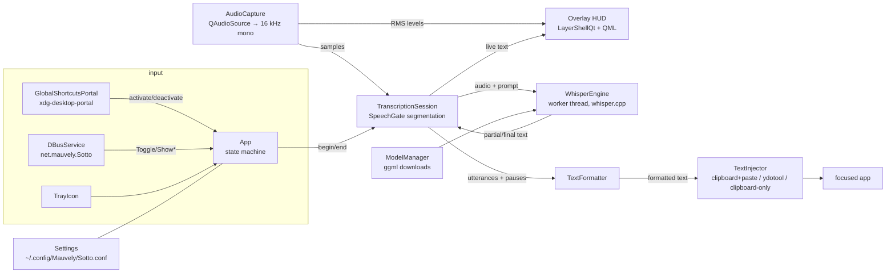

# Sotto — Architecture

One process, one binary. A Qt 6 application that lives in the background
(tray icon), owns a layer-shell overlay window, and runs whisper.cpp on a
worker thread. A second `sotto` invocation forwards its command to the running
instance through `SingleInstance` — the session bus on Linux, a named pipe on
Windows — and exits.

## Components

| Component | Files | Notes |
|---|---|---|
| State machine & wiring | `src/core/App.*` | `idle → loading → listening → finalizing → inserting → idle`. Exposed to QML as `App`. |
| Persistent config | `src/core/Settings.*` | QSettings INI; exposed to QML as `Config`. Tuning knobs (`tuning/*`) have no UI on purpose. |
| Single instance / IPC | `src/core/SingleInstance.*` | Facade: wraps `DBusService` on Linux (bus name doubles as the lock, still qdbus-scriptable), a `QLocalServer` pipe on Windows. |
| Audio | `src/audio/AudioCapture.*` | Any device format → mono float 16 kHz (channel-average + linear resample). Emits `samples` (STT) and `level` (~30 Hz, visualiser). |
| VAD gate | `src/stt/SpeechGate.h` | Pure header, adaptive noise floor + hangover. Unit-tested. |
| Segmentation & partials | `src/stt/TranscriptionSession.*` | Sample-clock driven (deterministic). 300 ms pre-roll so first words aren't clipped; silence > `silenceMs` commits an utterance; a partial decode of the in-progress utterance is requested every `partialIntervalMs`; the pause length between utterances is recorded for the formatter. |
| Whisper | `src/stt/WhisperEngine.*` | Worker `QThread`; queued slots serialize decodes. Partials decode greedy/no-fallback; finals get temperature fallback. Previously committed text is passed as `initial_prompt` for cross-utterance consistency. |
| Models | `src/stt/ModelManager.*` | Catalog + downloader (HF whisper.cpp repo) with progress, ggml magic validation, `.part` staging. |
| Formatting | `src/format/TextFormatter.*` | Pure functions, unit-tested. Artifact stripping, voice commands, pause-based paragraphs, punctuation/capitalisation normalisation. |
| Injection | `src/inject/*` | Strategy interface, see README table. `PortalRemoteDesktop` holds a persistent portal session (restore token in config) so the permission prompt appears once. On Windows the paste keystroke and the type-it strategy go through `SendInput`. |
| Hotkey | `src/hotkey/*` | `HotkeyBackend` alias: `GlobalShortcutsPortal` (portal session + `BindShortcuts`) on Linux, `WinHotkey` (`RegisterHotKey` + release polling) on Windows. Both emit `activated`/`deactivated` for toggle and hold-to-talk. |
| Portal plumbing | `src/portal/PortalRequest.*` | The Request/Response dance shared by hotkey + remote desktop. |
| Overlay | `src/ui/OverlayController.*`, `qml/Overlay.qml` | See below. |
| Tray | `src/ui/TrayIcon.*` | SNI via QSystemTrayIcon. |
| Design tokens | `qml/Brand.qml`, `qml/Theme.qml` | Both singletons. `Brand` is the raw ramps and never changes; `Theme` is the semantic layer — grounds, panels, text tiers, motion — resolved from `Config.darkMode`. Every colour and duration in the QML goes through `Theme`, so the light/dark toggle is one binding. |
| Chrome | `qml/SPanel.qml`, `qml/SSection.qml` | A content region on the window ground: 16px radius, no border, 16px gutters. Panels are separated by the ground showing through, which is why they have no outline. |
| Controls | `qml/S{Button,Radio,CheckBox,Switch,ComboBox,TextField,Slider,Label}.qml` | Brand skins over `QtQuick.Controls.Basic`. The Basic style's own indicators are flat greys that belong to neither theme; that is the only reason these exist. |

## Threading model

Everything runs on the main thread except whisper decodes:

- `WhisperEngine` lives on its own `QThread`. Cross-thread signal/slot
  connections (queued) form the request/response protocol; the thread's event
  loop serializes decode requests FIFO, so finals are never reordered.
- Audio callbacks (`QIODevice::readyRead`) fire on the main thread; per-chunk
  work is trivial (resample + RMS).

## The overlay window

`OverlayController` instantiates `qml/Overlay.qml` and, on Wayland with
LayerShellQt available, attaches a layer-shell surface **to that window only**
(modern LayerShellQt installs the shell integration per-window, so the
settings/notepad windows stay ordinary xdg-toplevels):

- layer **overlay**, anchored **bottom**, margin 32 px, exclusive zone 0
- keyboard interactivity **none** → never steals focus, and tiling
  compositors never tile a layer surface (Hyprland requirement solved by
  construction)
- screen setting `auto` → null output → **KWin and Hyprland place the surface
  on the active monitor**; hiding destroys the surface, so the choice is
  re-evaluated on every show. A fixed monitor can be chosen in Settings.

Without LayerShellQt (X11, dev containers) it degrades to a frameless
always-on-top `Qt::Tool` window positioned on the screen under the cursor.

`Config.overlayTranslucent` drops the pill to 55% alpha so the compositor's
blur can show through. Built against `KF6WindowSystem` (optional,
`SOTTO_HAVE_KWINDOWSYSTEM`), `OverlayController` also asks KWin for
blur-behind over the pill's capsule region — re-requested on every show,
since hiding destroys the wl surface. `App.blurAvailable` tells the UI
whether that path was compiled in; Hyprland users get the same effect with
`layerrule = blur, sotto-hud`.

The HUD follows the Mauvely brand: a pill in the theme's tinted chrome colour
(`Theme.chromePanel` — `#1b1a33` dark, `#f5f3ff` light), the logo mark (arcs in
the theme's text ink, teal signal dot), 22 teal level bars, a live transcript
line (elided from the left so the newest words stay visible), and a teal-tinted
`LOCAL` badge.

Every duration in the app goes through `Theme.durFast` / `durBase` / `durSlow`,
which return **0** when `Config.animationsEnabled` is off — a QML animation given
a zero duration hands its end value straight over, so "off" is the same code
arriving at once rather than a second path nobody exercises. The HUD's entrance
is a fade plus a 3% scale at `durSlow`; it deliberately omits the design system's
4px rise, because the window *is* the pill and `OverlayController` derives the
KWin blur region from the window's geometry.

## Latency budget (defaults)

- partial feedback: ≤ ~1.1 s cadence + decode time (sub-second on GPU for the
  turbo model)
- end of utterance: 700 ms silence + one final decode
- end of recording: tail decode + formatting + injection (~150 ms paste delay)

## Portability roadmap

| Target | What changes |
|---|---|
| Hyprland / wlroots | Nothing in the overlay (layer-shell already). Add a `wtype` injector (wlroots implements virtual-keyboard); GlobalShortcuts portal exists via `xdg-desktop-portal-hyprland`, plus `sotto --toggle` for `bind = ...` users. Optional Quickshell HUD could replace the QML overlay via the same D-Bus surface. |
| GNOME | Layer-shell is not supported → fallback window path or a GNOME shell extension; portals all work. |
| Windows | **Ported** (untested on real hardware): WASAPI capture via Qt Multimedia (unchanged), `WinHotkey`, `SendInput` injection, fallback overlay window, `QLocalServer` single instance, tray-balloon notifications, registry autostart. Open: Mica/acrylic for the translucent HUD, installer. |
| CUDA / Vulkan | Build-time only: `-DSOTTO_GPU=cuda|vulkan`. |
| Android (idea) | whisper.cpp + the STT/formatting core port cleanly; everything else changes — dictation would live in an IME (keyboard app), not an overlay + injector. Noted on the roadmap, not started. |

## Deliberate v1 simplifications

- Energy-based VAD instead of whisper.cpp's Silero integration (planned).
- Whole-utterance re-decode for partials instead of token-level streaming;
  utterances are capped at 25 s so the window stays well inside Whisper's 30 s.
- Injection never types unicode via keycodes; anything beyond the paste
  keystroke goes through the clipboard.
- No i18n scaffolding yet (strings are `tr()`-wrapped already).
- Two dictation targets only (`App::Target`): the focused app via
  `TextInjector`, or the built-in notepad window. There is no chat-style
  transcript window — a scrollback of past dictations is not part of the app.
