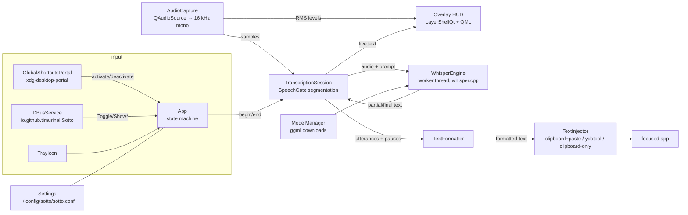

# Sotto — Architecture

One process, one binary. A Qt 6 application that lives in the background
(tray icon), owns a layer-shell overlay window, and runs whisper.cpp on a
worker thread. A second `sotto` invocation forwards its command over D-Bus
to the running instance and exits.

## Components

| Component | Files | Notes |
|---|---|---|
| State machine & wiring | `src/core/App.*` | `idle → loading → listening → finalizing → inserting → idle`. Exposed to QML as `App`. |
| Persistent config | `src/core/Settings.*` | QSettings INI; exposed to QML as `Config`. Tuning knobs (`tuning/*`) have no UI on purpose. |
| Single instance / IPC | `src/core/DBusService.*` | Session-bus name doubles as the single-instance lock. |
| Audio | `src/audio/AudioCapture.*` | Any device format → mono float 16 kHz (channel-average + linear resample). Emits `samples` (STT) and `level` (~30 Hz, visualiser). |
| VAD gate | `src/stt/SpeechGate.h` | Pure header, adaptive noise floor + hangover. Unit-tested. |
| Segmentation & partials | `src/stt/TranscriptionSession.*` | Sample-clock driven (deterministic). 300 ms pre-roll so first words aren't clipped; silence > `silenceMs` commits an utterance; a partial decode of the in-progress utterance is requested every `partialIntervalMs`; the pause length between utterances is recorded for the formatter. |
| Whisper | `src/stt/WhisperEngine.*` | Worker `QThread`; queued slots serialize decodes. Partials decode greedy/no-fallback; finals get temperature fallback. Previously committed text is passed as `initial_prompt` for cross-utterance consistency. |
| Models | `src/stt/ModelManager.*` | Catalog + downloader (HF whisper.cpp repo) with progress, ggml magic validation, `.part` staging. |
| Formatting | `src/format/TextFormatter.*` | Pure functions, unit-tested. Artifact stripping, voice commands, pause-based paragraphs, punctuation/capitalisation normalisation. |
| Injection | `src/inject/*` | Strategy interface, see README table. `PortalRemoteDesktop` holds a persistent portal session (restore token in config) so the permission prompt appears once. |
| Hotkey | `src/hotkey/GlobalShortcutsPortal.*` | Portal session + `BindShortcuts`; `Activated`/`Deactivated` support toggle and hold-to-talk. |
| Portal plumbing | `src/portal/PortalRequest.*` | The Request/Response dance shared by hotkey + remote desktop. |
| Overlay | `src/ui/OverlayController.*`, `qml/Overlay.qml` | See below. |
| Tray | `src/ui/TrayIcon.*` | SNI via QSystemTrayIcon. |

## Threading model

Everything runs on the main thread except whisper decodes:

- `WhisperEngine` lives on its own `QThread`. Cross-thread signal/slot
  connections (queued) form the request/response protocol; the thread's event
  loop serializes decode requests FIFO, so finals are never reordered.
- Audio callbacks (`QIODevice::readyRead`) fire on the main thread; per-chunk
  work is trivial (resample + RMS).

## The overlay window

`OverlayController` instantiates `qml/Overlay.qml` and, on Wayland with
LayerShellQt available, attaches a layer-shell surface **to that window only**
(modern LayerShellQt installs the shell integration per-window, so the
settings/notepad windows stay ordinary xdg-toplevels):

- layer **overlay**, anchored **bottom**, margin 32 px, exclusive zone 0
- keyboard interactivity **none** → never steals focus, and tiling
  compositors never tile a layer surface (Hyprland requirement solved by
  construction)
- screen setting `auto` → null output → **KWin and Hyprland place the surface
  on the active monitor**; hiding destroys the surface, so the choice is
  re-evaluated on every show. A fixed monitor can be chosen in Settings.

Without LayerShellQt (X11, dev containers) it degrades to a frameless
always-on-top `Qt::Tool` window positioned on the screen under the cursor.

The HUD itself is monochrome: black pill, white logo mark (dot + two arcs),
22 live level bars, live transcript line (elided from the left so the newest
words stay visible), and a `LOCAL` badge. All `Behavior`/animations are gated
on `Config.animationsEnabled`.

## Latency budget (defaults)

- partial feedback: ≤ ~1.1 s cadence + decode time (sub-second on GPU for the
  turbo model)
- end of utterance: 700 ms silence + one final decode
- end of recording: tail decode + formatting + injection (~150 ms paste delay)

## Portability roadmap

| Target | What changes |
|---|---|
| Hyprland / wlroots | Nothing in the overlay (layer-shell already). Add a `wtype` injector (wlroots implements virtual-keyboard); GlobalShortcuts portal exists via `xdg-desktop-portal-hyprland`, plus `sotto --toggle` for `bind = ...` users. Optional Quickshell HUD could replace the QML overlay via the same D-Bus surface. |
| GNOME | Layer-shell is not supported → fallback window path or a GNOME shell extension; portals all work. |
| Windows | Replace: AudioCapture (WASAPI via Qt Multimedia — already abstract), hotkey (`RegisterHotKey`), injection (`SendInput`), overlay (borderless topmost window — the fallback path already models this). whisper.cpp: CUDA/Vulkan. |
| CUDA / Vulkan | Build-time only: `-DSOTTO_GPU=cuda|vulkan`. |

## Deliberate v1 simplifications

- Energy-based VAD instead of whisper.cpp's Silero integration (planned).
- Whole-utterance re-decode for partials instead of token-level streaming;
  utterances are capped at 25 s so the window stays well inside Whisper's 30 s.
- Injection never types unicode via keycodes; anything beyond the paste
  keystroke goes through the clipboard.
- No i18n scaffolding yet (strings are `tr()`-wrapped already).
